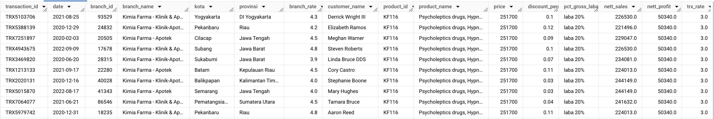
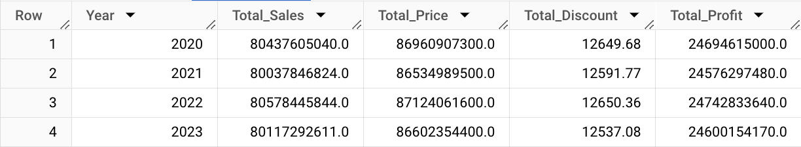
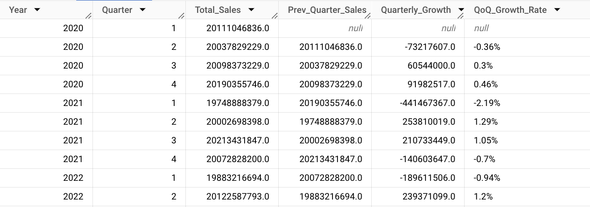
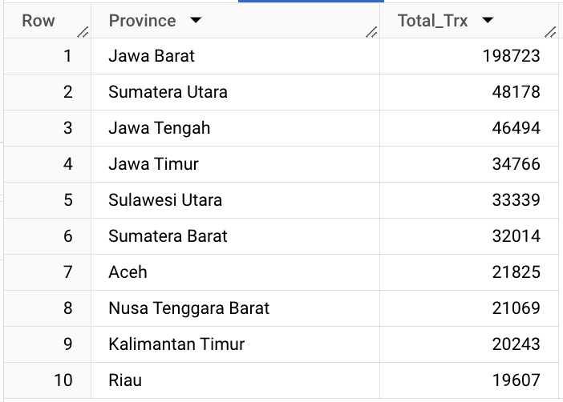
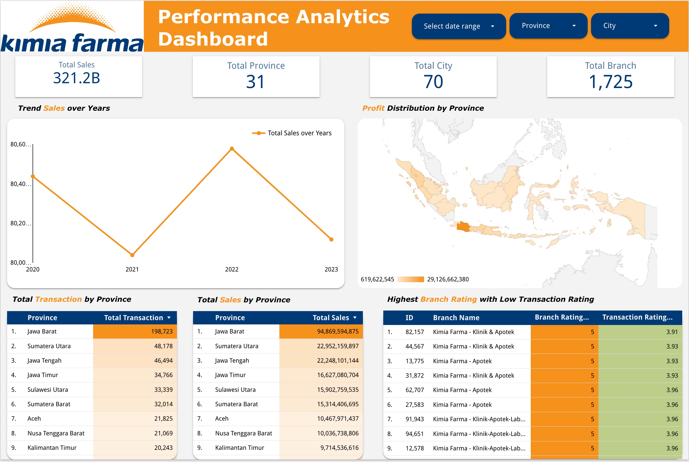

# Performance Analytics Dashboard
Tools: <br>
👩🏻‍💻 Visual Studio Code <br>
👩🏻‍💻 Google BigQuery <br>
🗂️ GitHub <br>
📊 Google Looker Studio

## Project Background 
Kimia Farma is the first pharmaceutical industry company in Indonesia which was founded by the Dutch East Indies Government in 1817. As a Big Data Analytics Intern at Kimia Farma, our duties will include a deep understanding of data and analytical skills. One of your main projects is evaluating Kimia Farma's business performance from 2020 to 2023

## Data Preparation
Before starting data processing, the first step that must be done is to prepare raw data into structured data and ready to be processed. Here's what I do at Data Preparation Stage:

1. Download datasets given
2. Create a new database and tables in **Google BigQuery** for the prepared datasets by adjusting the data type of each column, also arranging Primary Keys and Foreign Keys for each table
3. Importing csv data into the database
4. Create entity relationships between tables based on the structure in the "Data Relationship"

<details>
  <summary>SQL Query</summary>
  
  ```sql
-- Data Preparation --
-- Create new schema -- 
CREATE SCHEMA IF NOT EXISTS `canvas-bot-415513.kimia_farma`;

-- Create table from dataset --
CREATE TABLE IF NOT EXISTS `canvas-bot-415513.kimia_farma.final_transaction`
(
	transaction_id STRING PRIMARY KEY,
	date DATE,
	branch_id INT64,
	customer_name STRING,
    product_id INT64, 
    price INT64,
    discount_percentage FLOAT64,
    rating FLOAT64
);

CREATE TABLE IF NOT EXISTS `canvas-bot-415513.kimia_farma.inventory`
(
	Inventory_ID STRING PRIMARY KEY,
    branch_id INT64,
    product_id INT64,
    product_name STRING,
    opname_stock INT64
);

CREATE TABLE IF NOT EXISTS `canvas-bot-415513.kimia_farma.kantor_cabang`
(
	branch_id INT64 PRIMARY KEY,
    branch_category	STRING,
    branch_name	STRING,
    kota STRING,
    provinsi STRING,
    rating FLOAT64
);

CREATE TABLE IF NOT EXISTS `canvas-bot-415513.kimia_farma.product`
(
	product_id STRING PRIMARY KEY,
    product_name STRING,
    product_category STRING,
    price INT64
);
  ```
</details>
<br>

Below is entity relationship diagram created based on interpretation available raw tables:

```mermaid
erDiagram
    final_transaction {
                transaction_id STRING PK,
                date DATE,
                branch_id INT64,
                customer_name STRING,
                product_id INT64, 
                price INT64,
                discount_percentage FLOAT64,
                rating FLOAT64
    }    
    inventory {
			    Inventory_ID STRING PK,
                branch_id INT64 FK,
                product_id INT64 FK,
                product_name STRING,
                opname_stock INT64
    }   
    kantor_cabang {
				branch_id INT64 PK,
                branch_category	STRING,
                branch_name	STRING,
                kota STRING,
                provinsi STRING,
                rating FLOAT64
    }   
    product {
                product_id STRING PK,
                product_name STRING,
                product_category STRING,
                price INT64
    }   

    inventory ||--o{ final_transaction : places
    final_transaction }o--|| kantor_cabang : covers
    final_transaction ||--o{ product : places
    product }o--|| final_transaction : covers
```
<p align="center">
Fig.1. <a href="https://drive.google.com/file/d/1bRNW78l5cujWbtwao92MX6IKR5Mxk64K/view?usp=sharing"> Entity Relationship Diagram
</p>

## Analysis Table
Before designing sales dashboard, I will create datamart from previously made raw data, consisting of base and aggregate tables using Google BigQuery.

<details>
  <summary>SQL Query</summary>
  
  ```sql
-- Base Tabel
CREATE TABLE `canvas-bot-415513.kimia_farma.base_table` AS (
SELECT
  ft.transaction_id,
  ft.date,
  kc.branch_id,
  kc.branch_name,
  kc.kota, 
  kc.provinsi,
  kc.rating AS branch_rate,
  ft.customer_name,
  p.product_id,
  p.product_name,
  p.price,
  ft.discount_percentage,
  CASE
    WHEN p.price >  500000 THEN 'laba 30%'
    WHEN p.price >= 300000 THEN 'laba 25%'
    WHEN p.price >=  100000 THEN 'laba 20%'
    WHEN p.price >= 50000 THEN 'laba 15%'
    ELSE 'laba 10%'
  END AS pct_gross_laba,
  (p.price - (p.price * ft.discount_percentage)) AS nett_sales,
  CASE
    WHEN p.price >  500000 THEN (p.price*(30/100))
    WHEN p.price >= 300000 THEN (p.price*(25/100))
    WHEN p.price >=  100000 THEN (p.price*(20/100))
    WHEN p.price >= 50000 THEN (p.price*(15/100))
    ELSE (p.price*(10/100))
  END AS nett_profit,
  ft.rating AS trx_rate
FROM `canvas-bot-415513.kimia_farma.final_transaction` AS ft
JOIN `canvas-bot-415513.kimia_farma.kantor_cabang` AS kc
  ON ft.branch_id = kc.branch_id
JOIN `canvas-bot-415513.kimia_farma.product` AS p
  ON ft.product_id = p.product_id
);

-- Aggregate Table 1 --
-- Yearly sales --
CREATE TABLE `canvas-bot-415513.kimia_farma.Yearly_Sales` AS (
SELECT
  EXTRACT(YEAR FROM DATE(date)) Year,
  ROUND(SUM(nett_sales),2) AS Total_Sales,
  ROUND(SUM(price),2) AS Total_Price,
  ROUND(SUM(discount_percentage),2) AS Total_Discount,
  ROUND(SUM(nett_profit),2) AS Total_Profit
FROM `canvas-bot-415513.kimia_farma.base_table`
GROUP BY 1
ORDER BY 1 ASC
);

-- Aggregate Table 2 --
-- Branch sales over years --
CREATE TABLE `canvas-bot-415513.kimia_farma.Branch_Sales` AS (
SELECT
  EXTRACT(YEAR FROM DATE(date)) Year,
  branch_name,
  ROUND(SUM(nett_sales),2) AS Total_Sales,
  ROUND(SUM(price),2) AS Total_price,
  ROUND(SUM(discount_percentage),2) AS Total_discount,
  ROUND(SUM(nett_profit),2) AS Total_nett_profit
FROM `canvas-bot-415513.kimia_farma.base_table`
GROUP BY 1,2
ORDER BY 1,2
);

-- Aggregate Table 3 --
-- Quarterly sales growth --
CREATE TABLE `canvas-bot-415513.kimia_farma.Quarterly_Sales_Growth` AS (
WITH sales_summary AS (
    SELECT
        EXTRACT(YEAR FROM date) AS Year,
        EXTRACT(QUARTER FROM date) AS Quarter,
        SUM(nett_sales) AS Total_Sales
    FROM
        `canvas-bot-415513.kimia_farma.base_table`
    GROUP BY 1, 2
    ORDER BY 1, 2
)
SELECT
    Year,
    Quarter,
    Total_Sales,
    LAG(Total_Sales) OVER (ORDER BY Year, Quarter) AS Prev_Quarter_Sales,
    Total_Sales - LAG(Total_Sales) OVER (ORDER BY Year, Quarter) AS Quarterly_Growth,
    CONCAT(CAST(ROUND(((Total_Sales - LAG(Total_Sales) OVER (ORDER BY Year, Quarter)) / LAG(Total_Sales) OVER (ORDER BY Year, Quarter)) * 100,2) AS STRING), '%') AS QoQ_Growth_Rate
FROM
    sales_summary
ORDER BY 1, 2
);


-- Aggregate Table 4 --
-- Product sales over years--
CREATE TABLE `canvas-bot-415513.kimia_farma.Product_Sales` AS (
SELECT
  EXTRACT(YEAR FROM DATE(date)) Year,
  product_name,
  ROUND(SUM(nett_sales),2) AS Total_Sales,
  ROUND(SUM(price),2) AS Total_Price,
  ROUND(SUM(discount_percentage),2) AS Total_Discount,
  ROUND(SUM(nett_profit),2) AS Total_Profit
FROM `canvas-bot-415513.kimia_farma.base_table`
GROUP BY 1,2
ORDER BY 1,2
);

-- Aggregate Table 5 --
-- Top 10 Total transaksi cabang provinsi --
CREATE TABLE `canvas-bot-415513.kimia_farma.Top10_Trx_Branch_Province` AS (
SELECT
  provinsi AS Province,
  COUNT(transaction_id) Total_Trx
FROM `canvas-bot-415513.kimia_farma.base_table`
GROUP BY 1
ORDER BY 2 DESC
LIMIT 10
);

-- Aggregate Table 6 --
-- Top 10 Nett sales cabang provinsi --
CREATE TABLE `canvas-bot-415513.Top10_Profit_Province` AS (
SELECT
  provinsi AS Province,
  ROUND(SUM(nett_sales)) AS Total_Profit
FROM `canvas-bot-415513.kimia_farma.base_table`
GROUP BY 1
ORDER BY 2 DESC
LIMIT 10
);

-- Aggregate Table 7 --
-- Top 5 Cabang Dengan Rating Tertinggi, namun Rating Transaksi Terendah --
CREATE TABLE `canvas-bot-415513.kimia_farma.Top_Branch_Rate_&_Low_Rate_Trx` AS (
SELECT
  branch_id AS Branch,
  branch_name AS Banch_Name,
  ROUND(AVG(branch_rate),2) AS Rating_Branch,
  -- branch_rate,
  ROUND(AVG(trx_rate),2) AS Rating_Trx
FROM `canvas-bot-415513.kimia_farma.base_table`
GROUP BY 1,2
ORDER BY 3 DESC, 4 ASC
LIMIT 5
);

-- Aggregate Table 8 --
-- Indonesia's Geo Map Untuk Total Profit Masing-masing Provinsi --
CREATE TABLE `canvas-bot-415513.kimia_farma.Geo_Profit_Map` AS (
SELECT
  provinsi AS Province,
  ROUND(SUM(nett_profit),2) AS Profit
FROM `canvas-bot-415513.kimia_farma.base_table`
GROUP BY 1
ORDER BY 2 DESC
);
  ```
</details>

<p align="center">
  <kbd> </kbd> <br>
  Fig.2. Base Table
</p>

<p align="center">
  <kbd> </kbd> <br>
  Fig.3. Yearly sales Summary
</p>

<p align="center">
  <kbd> </kbd> <br>
  Fig.4. Quarterly Sales Growth
</p>

<p align="center">
  <kbd> </kbd> <br>
  Fig.5. Top 10 Total Transaction by Province
</p>

## Task 03 : Dashboard Design
After designing Datamart from raw data, I built Performance Analytics Dashboard based on the aggregate tables previously created. For Interactive Dasboard please click  <a href="https://lookerstudio.google.com/reporting/9fcc68e1-58e6-4d36-a33c-3a89f6f16c6c">this link</a>

<p align="center">
  <kbd> </kbd> <br>
  Fig.6. <a href="https://lookerstudio.google.com/reporting/9fcc68e1-58e6-4d36-a33c-3a89f6f16c6c">Kimia Farma Performance Analytics Dashboard</a>
</p>

From the dashboard, some insights can be seen as follows:
- Total sales were 321,2 B, 31 provinces, 70 cities, and 1725 branches
- There has been a fluctuation in sales over the past four years and a peak in 2022 at 80.5 B.
- The top 10 transactions and sales by province remain the same, Jawa Barat, Sumatera Utara, Jawa Tengah, Jawa Timur, Sulawesi Utara, and so on.
<br>

Recommendation can be converted into marketing strategies as below:
- Focus marketing efforts on provinces with consistently high sales, then product offerings tailored to these regions to maintain and potentially increase market share.
- Leverage digital marketing channels such as social media, email marketing, and online advertising to reach a wider audience and drive online and offline sales.
- With 1725 branches across 31 provinces and 70 cities, consider expanding branch presence strategically, focusing on areas with high growth potential or underserved markets. This can help increase accessibility and convenience for customers, leading to higher sales.
<br>